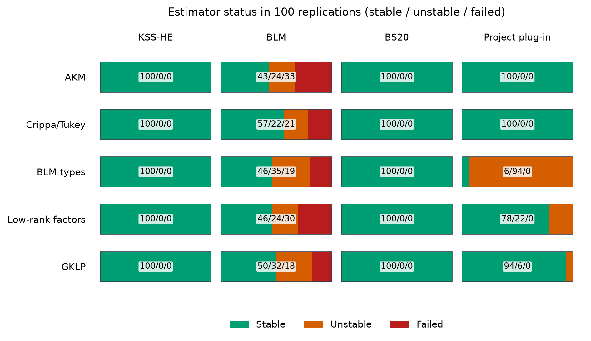
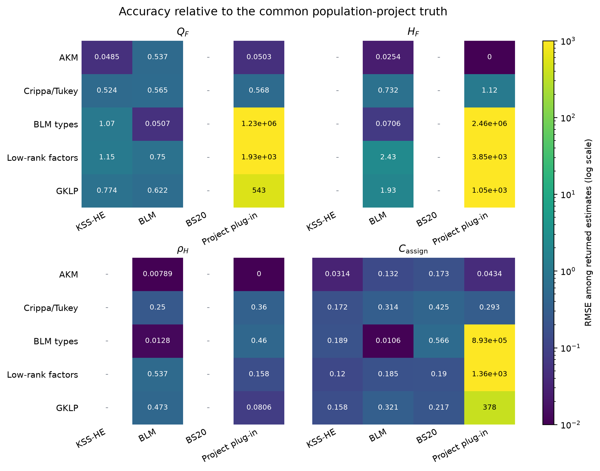
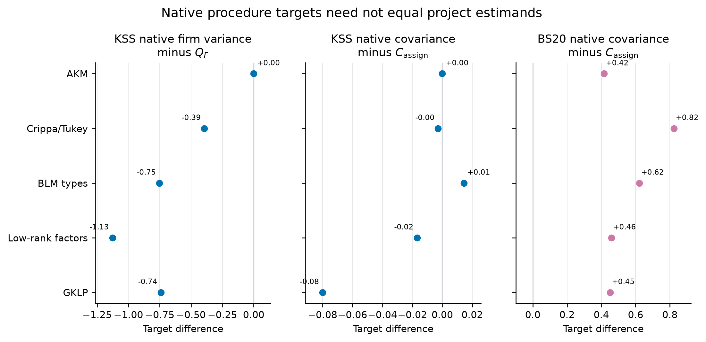
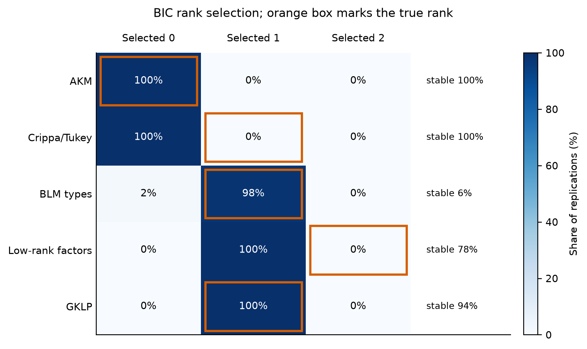
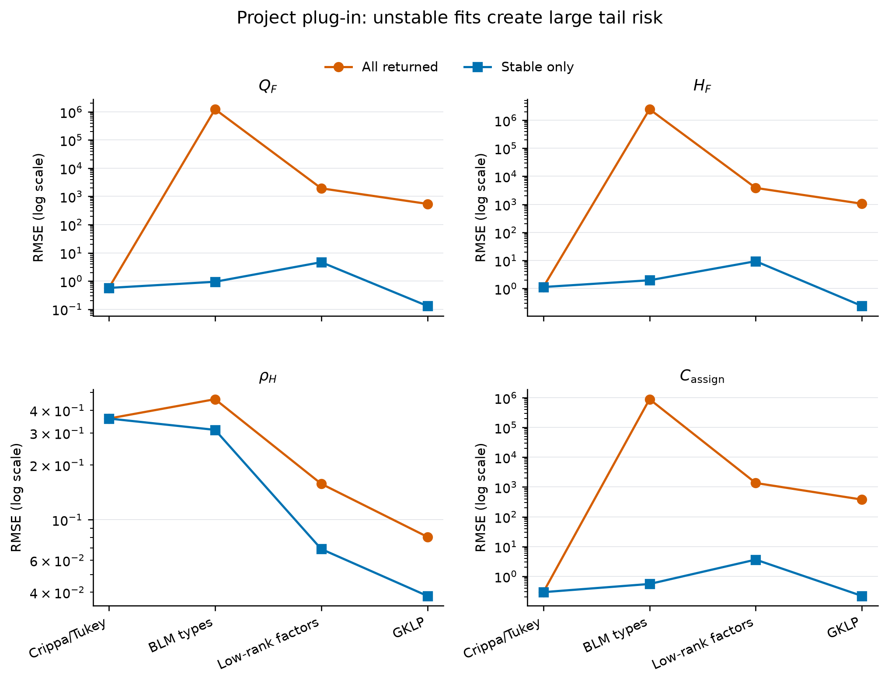

# DGP-by-estimator Monte Carlo: methods and results

This report asks a deliberately symmetric question: what happens when each of four procedures is applied to data from each of five worker-firm wage models? The answer is not a single winner. KSS and BLM perform well when their own structures are correct, while nonadditivity, rank selection, sparse support, and differences in estimands explain the cross-model reversals.

Every numerical statement below is derived from the immutable merged output with configuration fingerprint `3e8ab3b57d35190989c47117f139b414b9f656db8a933d6c5d1df6d2aa5fbcc4`. Equations attributed to papers are cited; all remaining equations and calculations are definitions or direct derivations from the simulation code.

## 1. Question and design

The simulation contains 100 replications of each DGP. Every replication has 300 workers, 18 firms, 10 periods, redraw probability 0.40, and independent Gaussian wage noise with standard deviation 0.50. The estimator settings are declared once and applied to every DGP, so the row of the experiment cannot turn an estimator on or off.

| DGP | Systematic wage schedule | Interaction rank |
|---|---|---:|
| AKM | $m_{ij}=\alpha_i+\psi_j$ | 0 |
| Crippa/Tukey | $m_{ij}=\alpha_i+\psi_j+\beta_0\alpha_i\psi_j$, $\beta_0=0.75$ | 1 |
| BLM types | $m_{ij}=a_{L_i}+p_{K_j}+u_{L_i}v_{K_j}$, two worker types and three firm classes | 1 |
| Low-rank factors | $m_{ij}=\alpha_i+\psi_j+U_i'\operatorname{diag}(1,0.5)V_j$ | 2 |
| GKLP | $m_{ij}=Z_i+c_j+b_j\eta_i+\frac{1}{2}b_j^2\sigma_e^2$ | 1 |

The Crippa row uses the Tukey surface in Crippa (2025, Section 2.2). The GKLP row is the residualized perfect-information wage expression in Gibbons, Katz, Lemieux, and Parent (2002, 2005). The BLM row uses discrete worker and firm types, while the project row uses continuous Gaussian factor coordinates.

Observed matches are drawn from a balanced assignment law:

$$
P_{ij}=a_i b_j\exp\{s_c\alpha_i\psi_j+s_h h_{ij}/\operatorname{sd}(h)\}.
$$

The constants $a_i$ and $b_j$ restore uniform worker and firm marginals. This holds population composition fixed while allowing sorting on the additive component and interaction gains.

## 2. Estimands and estimators

| Symbol | Definition | Interpretation |
|---|---|---|
| $Q_F$ | product-weighted firm-side schedule variance | Firm contribution in the complete schedule |
| $H_F$ | twice the product-weighted interaction variance | Magnitude of nonadditivity |
| $\rho_H$ | interaction share of $Q_F$ | Relative importance of nonadditivity |
| $C_{\mathrm{assign}}$ | covariance induced by observed assignment | Sorting covariance in realized matches |

The project procedure is the current low-rank plug-in with BIC rank selection, without the unfinished LOO correction. KSS estimates additive-projection variance components. BLM estimates a discrete worker-type by firm-class wage surface. BS20 estimates moments of worker and firm wage types. Because those objects are not identical under nonadditivity, the report distinguishes native-target accuracy from accuracy relative to the common population-project truth.

## 3. Evaluation rules

A fit is **stable** only when its procedure-specific numerical diagnostics pass. An **unstable** fit returned finite values but failed those diagnostics; a **failure** returned no estimate. Headline RMSE includes every returned value and is always displayed with the stable, unstable, and failed counts. Stable-only RMSE is a conditional robustness calculation, not a replacement for the headline result.

For continuous DGPs, BLM receives no oracle type labels. Product-marginal wage means define fixed equal-count reference groups only for scoring its fitted cell table. The BLM functionals are also compared with the full project truth, so discretization error remains part of the comparison.

## 4. Results

### 4.1 Completion and numerical stability

The table and figure report stable / unstable / failed attempts. KSS and BS20 return stable values in all 500 DGP-replications. BLM is much more sensitive to cleaned-sample support. The project BIC fit is stable in the additive and Crippa rows, but only 6% of grouped-BLM replications.

| DGP | KSS | BLM | BS20 | Project plug-in |
|---|---:|---:|---:|---:|
| AKM | 100 / 0 / 0 | 43 / 24 / 33 | 100 / 0 / 0 | 100 / 0 / 0 |
| Crippa/Tukey | 100 / 0 / 0 | 57 / 22 / 21 | 100 / 0 / 0 | 100 / 0 / 0 |
| BLM types | 100 / 0 / 0 | 46 / 35 / 19 | 100 / 0 / 0 | 6 / 94 / 0 |
| Low-rank factors | 100 / 0 / 0 | 46 / 24 / 30 | 100 / 0 / 0 | 78 / 22 / 0 |
| GKLP | 100 / 0 / 0 | 50 / 32 / 18 | 100 / 0 / 0 | 94 / 6 / 0 |

BLM has 121 failures out of 500 attempts. 118 are directly attributable to no stayer event or a missing stayer firm class after procedure-specific cleaning. The remaining failures are invalid likelihood starts. This is why BLM accuracy cannot be summarized without its return rate.

### 4.2 Correctly specified benchmarks

The expected benchmarks work. Under the additive AKM DGP, KSS-HE estimates $Q_F$ with bias +0.0032 and RMSE 0.048; its assignment-covariance bias is -0.0001. Under the grouped BLM DGP, the 81 returned BLM fits have biases -0.0050 for $Q_F$, -0.0004 for $H_F$, and +0.0023 for $C_{\mathrm{assign}}$. Thus the main problem for BLM in its preferred row is support and completion, not bias among returned fits.

### 4.3 Cross-DGP accuracy

Figure 2 compares RMSE against the common population-project truth. A blank cell means that the procedure does not estimate that object. The log color scale is necessary because unstable positive-rank project fits generate very large tail errors in some rows.

KSS remains accurate for its additive projection, but its error relative to project $Q_F$ expands when nonadditivity changes the target. BLM is highly accurate on the grouped DGP when it returns. The project BIC procedure performs well for GKLP conditional on stability, but performs poorly for Crippa because BIC always removes the true rank-one interaction. Under the rank-two DGP, BIC always selects rank one and some returned fits have very large functional errors.

### 4.4 Native targets versus the common project truth

A procedure can estimate its own target accurately while differing systematically from the project estimand. The target differences below are native target minus project target; they are properties of the simulated population, not estimation bias.

| DGP | KSS $Q_F$ gap | KSS covariance gap | BS20 covariance gap |
|---|---:|---:|---:|
| AKM | +0.0000 | +0.0000 | +0.416 |
| Crippa/Tukey | -0.394 | -0.0028 | +0.824 |
| BLM types | -0.752 | +0.014 | +0.622 |
| Low-rank factors | -1.127 | -0.017 | +0.459 |
| GKLP | -0.741 | -0.080 | +0.452 |

This distinction explains why a small native-target bias is not enough to establish accuracy for $Q_F$ or $C_{\mathrm{assign}}$ under a nonadditive DGP.

### 4.5 Rank selection

| DGP | True rank | Selected ranks (0 / 1 / 2) | Stable |
|---|---:|---:|---:|
| AKM | 0 | 100 / 0 / 0 | 100% |
| Crippa/Tukey | 1 | 100 / 0 / 0 | 100% |
| BLM types | 1 | 2 / 98 / 0 | 6% |
| Low-rank factors | 2 | 0 / 100 / 0 | 78% |
| GKLP | 1 | 0 / 100 / 0 | 94% |

Rank selection succeeds in the additive and GKLP rows. It fails systematically in the two most informative continuous misspecification tests: Crippa is always assigned rank zero, and the continuous rank-two DGP is always assigned rank one. The grouped DGP is usually assigned rank one, but that does not ensure stable continuous-factor recovery because many workers share identical latent coordinates.

### 4.6 Instability and tail risk

Figure 5 compares RMSE across all returned project-BIC values with RMSE conditional on stability. Large gaps mean that a small set of numerically unstable fits dominates squared error. The stable-only line answers a useful diagnostic question, but it is selection-conditional and therefore cannot be presented as unconditional estimator performance.

## 5. Interpretation

First, the original all-AKM comparison was uninformative because it rewarded additive estimators by construction. The full matrix now exposes both model misspecification and estimand differences.

Second, correct specification is visible but not sufficient. KSS is accurate under AKM, and returned BLM fits are accurate under the grouped BLM DGP. BLM nevertheless needs enough mover and stayer support after cleaning.

Third, the current project plug-in's central weakness is rank selection and positive-rank numerical stability, not merely small-sample bias. The Crippa and rank-two results show that BIC can erase or truncate economically meaningful nonadditivity. This finding should guide development of the eventual LOO estimator: rank choice and functional stability must be addressed before a leave-out correction can solve bias.

Fourth, no single RMSE table can honestly compare all procedures on all quantities. KSS and BS20 have native targets that differ from the schedule-based objects, and only BLM and the project procedure yield all four project functionals. The report therefore shows native and common-target results separately.

## 6. Reproducibility

The merged run contains 29,085 scalar records and 4,300 estimator attempts. All 100 replication indices occur exactly once. The editable source tables and vector figures are in `reports/dgp_estimator_matrix`; the immutable simulation inputs are in `results/dgp_estimator_matrix/merged`.

The report can be regenerated without calling Codex:

`& .\.venv311\Scripts\python.exe scripts\report_dgp_estimator_matrix.py`

`& .\.venv311\Scripts\python.exe scripts\build_simulation_writeup_pdf.py --input DGP_ESTIMATOR_RESULTS.md --output output\pdf\dgp_estimator_matrix_report.pdf`

## References

Bonhomme, S., Lamadon, T., and Manresa, E. (2019). A Distributional Framework for Matched Employer-Employee Data. *Econometrica*, 87(3), 699-739. [doi:10.3982/ECTA15722](https://doi.org/10.3982/ECTA15722).

Borovickova, K., and Shimer, R. (2017; February 2020 manuscript version). High Wage Workers Work for High Wage Firms. NBER Working Paper 24074. [doi:10.3386/w24074](https://doi.org/10.3386/w24074).

Crippa, F. (2025). Identification, Estimation, and Inference in Two-Sided Interaction Models. Manuscript supplied to the project, Section 2.2.

Gibbons, R., Katz, L. F., Lemieux, T., and Parent, D. (2002). Comparative Advantage, Learning, and Sectoral Wage Determination. NBER Working Paper 8889. Published in *Journal of Labor Economics* 23(4), 681-723 (2005). [doi:10.3386/w8889](https://doi.org/10.3386/w8889).

Kline, P., Saggio, R., and Solvsten, M. (2020). Leave-Out Estimation of Variance Components. *Econometrica*, 88(5), 1859-1898. [doi:10.3982/ECTA16410](https://doi.org/10.3982/ECTA16410).
