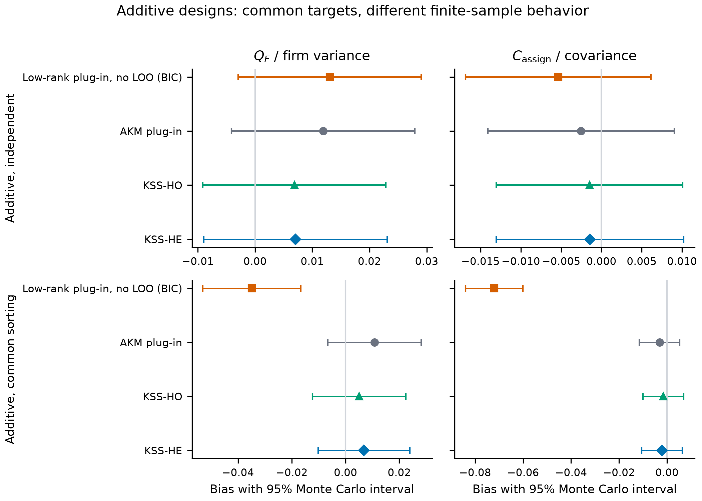
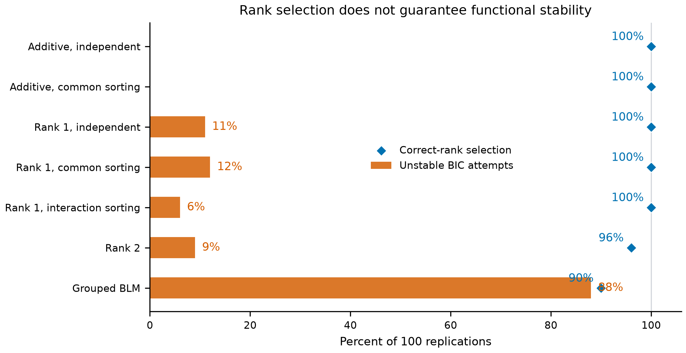
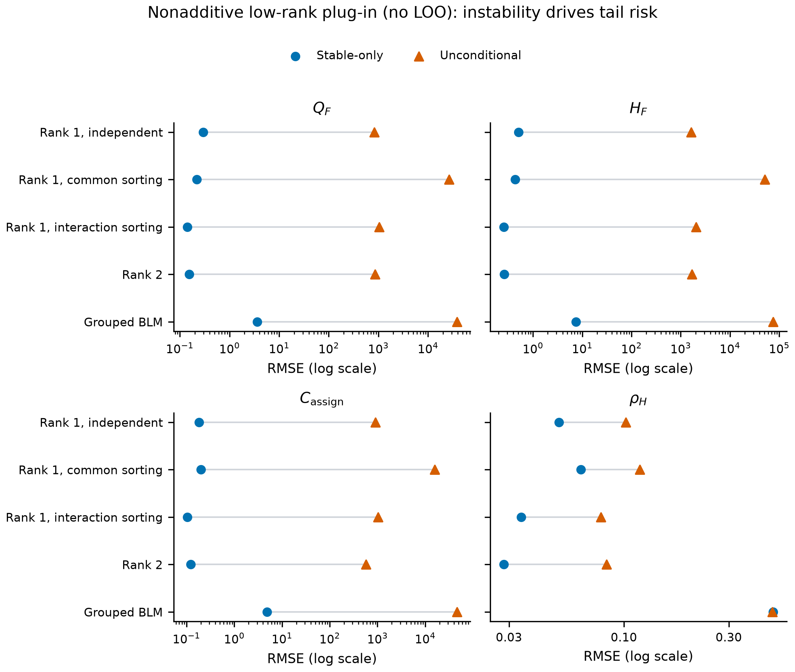
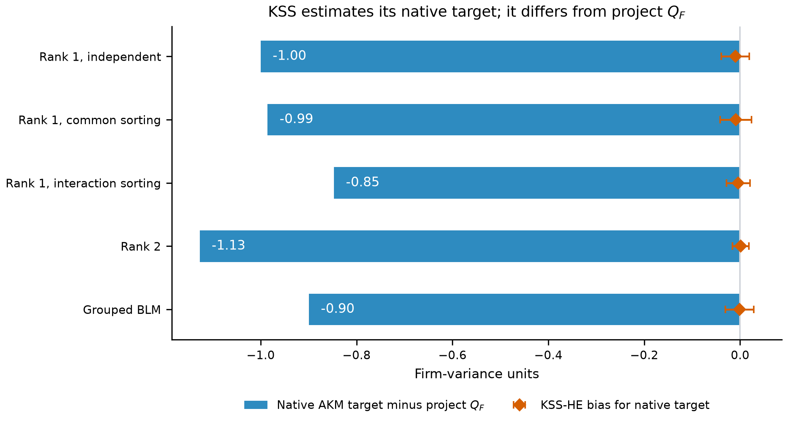
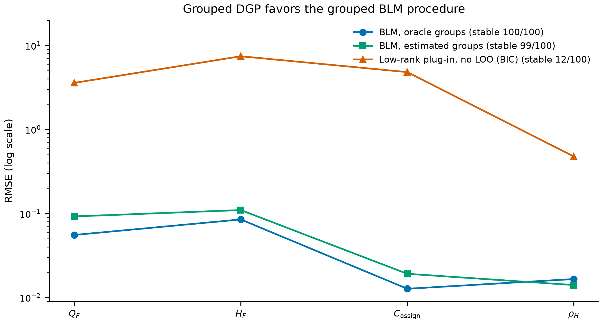
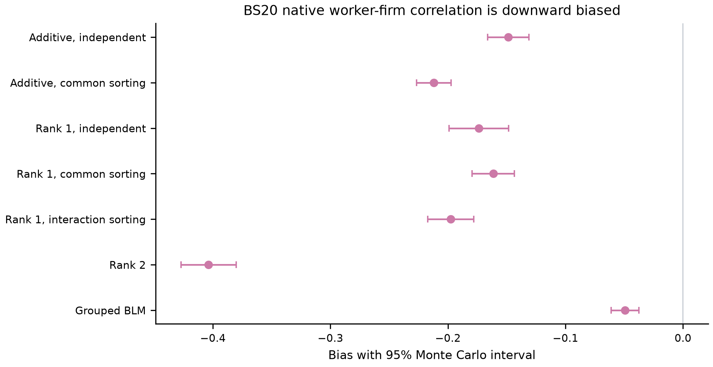

# Comparing Schedule-Based Low-Rank Functionals with KSS, BLM, and Borovičková-Shimer

## Purpose and reading guide

This note asks a simple simulation question: when the true worker-firm wage
schedule is known, how well do several procedures recover the population
objects they are meant to estimate?

Two terms are important. An **estimand** is the true population quantity we
want to learn. An **estimator** is the rule that uses a finite sample to
estimate it. Different procedures do not always have the same estimand. In
particular, KSS is built around an additive worker-firm model, while the
project's estimands use the complete wage schedule and can include
worker-firm interactions. The simulation therefore separates:

1. estimation error relative to each procedure's own, or *native*, estimand;
2. the gap between that native estimand and the project's estimand.

The project procedure currently implemented is the **low-rank plug-in without
LOO correction**. The full leave-worker-out estimator is still under
development, so this note does not claim to evaluate it.

The experiment has seven designs and 100 replications per design. Because the
simulator creates the complete population wage schedule, every population
target can be calculated exactly before sampling begins.

Statements labeled **Source** report a definition, method, design choice, or
stored numerical result. Statements labeled **Derived** follow from those
definitions or summarize the stored Monte Carlo output.

*Source: `SIMULATION_CONTRACT.md`; `configs/full_ladder.json`;
`PRODUCTION_RESULTS.md`; reporting commit `8922da6`; production configuration
fingerprint `e03e0c242706502fcd58f20c1cc52c4deeb234f48c981a4885e13157d6ac2a09`.*

## Notation

*Source: project notation and estimand definitions in
`SIMULATION_CONTRACT.md`; BLM and BS notation is specialized from the cited
papers as described in Sections 2.3 and 2.4 below.*

| Symbol | Meaning | Why it matters |
|---|---|---|
| $i,j$ | Worker and firm indices; $I,J$ denote random workers and firms. | They identify a cell in the worker-by-firm wage schedule. |
| $Y_{ij}$ | Observed wage, or log wage, for worker $i$ at firm $j$. | This is what the estimator sees in sampled matches. |
| $m_{ij}$ | Systematic wage for worker $i$ at firm $j$, before wage noise. | The simulator knows every $m_{ij}$, including unobserved matches. |
| $M=(m_{ij})$ | Complete systematic wage schedule. | Project estimands are functionals of this matrix. |
| $P^{\mathrm{obs}}$ | Population assignment probabilities over worker-firm pairs. | These probabilities describe who works where. |
| $p_i,q_j$ | Worker and firm marginals of $P^{\mathrm{obs}}$. | They weight workers and firms in the project estimands. |
| $\mu,a_i,b_j,h_{ij}$ | Grand mean, worker main effect, firm main effect, and interaction in the schedule decomposition. | They separate additive wage variation from worker-firm-specific gains. |
| $Q_F$ | Average firm-side wage variation across workers. | It measures how much a worker's systematic wage changes across firms. |
| $H_F$ | Average variation across workers in pairwise firm wage differences. | It measures heterogeneity in workers' relative rankings of firms. |
| $\rho_H$ | Interaction share $H_F/(2Q_F)$. | It records the share of firm-side wage variation due to interactions. |
| $C_{\mathrm{assign}}$ | Assignment contribution to systematic-wage variance. | It compares observed assignment with random matching that preserves $p_i$ and $q_j$. |
| $V_\psi^{\mathrm{AKM}}$ | Firm-effect variance in the additive AKM projection. | Under nonadditivity, it need not equal $Q_F$. |
| $A_{\ell k}^{\mathrm{BLM}}$ | Mean wage for worker type $\ell$ and firm class $k$. | This is the grouped BLM mean target. |
| $\rho_{\mathrm{BS}}$ | Correlation between BS worker and firm wage types on observed matches. | It is a sorting measure, but it is not $C_{\mathrm{assign}}$. |
| $\widehat r_{\mathrm{BIC}}$ | Rank selected by the exploratory common-support BIC rule. | It chooses among the fitted low-rank models. |
| $e_b$ | Estimate minus target in replication $b$. | Bias and RMSE are computed from these errors. |

## 1. Model and population targets

### 1.1 What the simulator generates

The project model is

$$
Y_{ij}=X_{ij}^{\prime}\delta+\alpha_i+\psi_j+u_i^{\prime}\Lambda v_j+\varepsilon_{ij}.
$$

The additive terms $\alpha_i$ and $\psi_j$ give worker and firm main effects.
The term $u_i^{\prime}\Lambda v_j$ allows the value of a firm to differ across
workers. This is the nonadditive interaction. The final term
$\varepsilon_{ij}$ is wage noise.

The current simulation sets $X_{ij}^{\prime}\delta=0$. It first creates the
systematic part of the wage for every possible worker-firm pair:

$$
m_{ij}=\alpha_i+\psi_j+u_i^{\prime}\Lambda v_j.
$$

It then draws actual matches using $P^{\mathrm{obs}}$ and adds wage noise.
Thus the estimators see only a noisy, incomplete panel, while the researcher
can use the full $M$ to calculate ground truth.

*Source: project model and `SIMULATION_CONTRACT.md`, Sections 1 and 4.*

### 1.2 Separating main effects from interactions

To define the project estimands, imagine randomly pairing workers and firms
using the observed worker shares $p_i$ and firm shares $q_j$. Under this
product distribution, the complete schedule can be written as

$$
m_{ij}=\mu+a_i+b_j+h_{ij}.
$$

Here, $\mu$ is the overall mean. The term $a_i$ is worker $i$'s average wage
advantage, $b_j$ is firm $j$'s average wage advantage, and $h_{ij}$ is what
remains for that particular worker-firm pair. The weighting rules make each
remaining component average to zero along the relevant dimension, so the
decomposition is unique.

This decomposition gives an intuitive distinction:

- **Additive separability:** $h_{ij}=0$ for every pair. Workers can have
  different wage levels, but they agree on firm wage differences.
- **Nonadditive separability:** some $h_{ij}\neq0$. A firm can be especially
  valuable to one worker and less valuable to another.

*Source: `SIMULATION_CONTRACT.md`, Sections 1 and 2.*

### 1.3 The four project estimands

The first estimand is

$$
Q_F=\sum_i p_i\operatorname{Var}_{q}(m_{iJ}).
$$

For each worker, $Q_F$ calculates wage variation across firms and then
averages that variance across workers. It includes both average firm
differences and worker-firm interactions.

The second estimand is

$$
H_F=\sum_{j,k}q_jq_k\operatorname{Var}_{p}(m_{Ij}-m_{Ik}).
$$

For each pair of firms, $H_F$ asks whether their wage difference is the same
for all workers. If every worker values firms $j$ and $k$ by the same amount,
the variance for that pair is zero. Averaging across firm pairs makes $H_F$ a
measure of interaction heterogeneity.

The normalized interaction share is

$$
\rho_H=\frac{H_F}{2Q_F}.
$$

The factor of two comes from the identity

$$
Q_F=\operatorname{Var}_{q}(b_J)+\frac{1}{2}H_F.
$$

Thus, when $Q_F>0$, $\rho_H$ is the fraction of firm-side wage variation
associated with worker-firm interactions rather than the common firm
component.

Finally, the assignment estimand is

$$
C_{\mathrm{assign}}
=\frac{1}{2}\left[
\operatorname{Var}_{P^{\mathrm{obs}}}(m_{IJ})
-\operatorname{Var}_{p\times q}(m_{IJ})
\right].
$$

The first variance uses observed assignment: workers are matched to firms as
in the population. The second randomly pairs them while preserving worker and
firm frequencies. A positive $C_{\mathrm{assign}}$ means observed assignment
creates more systematic-wage dispersion than this random-matching reference.

Under additive separability, the definitions simplify to

$$
H_F=0,\qquad \rho_H=0,\qquad
Q_F=\operatorname{Var}_{q}(b_J),
\qquad
C_{\mathrm{assign}}=\operatorname{Cov}_{P^{\mathrm{obs}}}(a_I,b_J).
$$

This special case matters because the project targets then coincide with the
usual additive firm-variance and worker-firm covariance targets.

*Source: `SIMULATION_CONTRACT.md`, Section 2. Derived explanations follow by
substituting the product-weighted decomposition into the four definitions.*

### 1.4 Why procedures can disagree even when both are well estimated

Under nonadditivity, an additive estimator and a schedule-based estimator can
be accurate for different population quantities. For any procedure $p$,

$$
\widehat{\theta}^{(p)}-\theta_{\mathrm{project}}
=
\left(\widehat{\theta}^{(p)}-\theta_p^\star\right)
+
\left(\theta_p^\star-\theta_{\mathrm{project}}\right).
$$

The first term is **estimation error**: did procedure $p$ recover its own
native target $\theta_p^\star$? The second is the **estimand gap**: is that
native target the same object as the project target? Reporting both prevents
a difference in scientific questions from being mistaken for a bad
estimator.

*Derived algebraic decomposition from the declared targets in
`SIMULATION_CONTRACT.md`, Section 5.*

## 2. Procedures compared

### 2.1 Project low-rank plug-in without LOO correction

The observed panel contains repeated wages for some worker-firm pairs and no
wage for many other pairs. Let $\bar Y_{ij}$ be the mean observed wage and
$n_{ij}$ the number of observations for an observed pair. For a chosen rank
$r$, the current project procedure solves

$$
\min_{\alpha,\psi,U,V}
\sum_{(i,j)\in E}n_{ij}
\left(\bar Y_{ij}-\alpha_i-\psi_j-u_i^{\prime}v_j\right)^2,
$$

where $E$ is the set of observed worker-firm pairs. The fitted low-rank model
then fills the missing cells of the wage schedule. In this objective,
$\Lambda$ is absorbed into the fitted factors $U$ and $V$. This is why the
interaction is written as $u_i^{\prime}v_j$ rather than
$u_i^{\prime}\Lambda v_j$; it is a different parameterization of the same
low-rank interaction matrix. The four project functionals are calculated from
the completed schedule.

The implementation uses weighted alternating least squares, several starting
values, factor centering, and singular-value normalization. Positive-rank
models are fitted on a connected support core with enough distinct matches
per worker and firm. An exploratory BIC rule compares ranks on the same
observed sample.

The procedure also labels a fit *unstable* when its numerical diagnostics
indicate unreliable completion. Its finite output is still included in
unconditional performance because a user applying the procedure would
receive that value. Stable-only summaries are reported separately to diagnose
what happens when completion works.

No quadratic or leave-worker-out correction is applied. Therefore this is a
plug-in benchmark, not the project's proposed full LOO estimator.

*Source: `SIMULATION_CONTRACT.md`, Sections 4 and 7;
`src/loo_sim/low_rank.py`; `src/loo_sim/monte_carlo.py`.*

### 2.2 AKM and KSS

AKM fits an additive worker and firm fixed-effects model. Its plug-in moments
use the estimated firm effects and worker effects directly. KSS-HO adjusts
quadratic moments under homoskedastic errors, while KSS-HE uses a
heteroskedastic leave-out correction. Kline, Saggio, and Sølvsten (2020)
develop leave-out estimators for quadratic forms in linear models.

When the true schedule is nonadditive, the native population target of
AKM/KSS in this experiment is the best additive approximation under observed
assignment:

$$
(\mu^{\mathrm{AKM}},\alpha^{\mathrm{AKM}},\psi^{\mathrm{AKM}})
=
\underset{\mu,\alpha,\psi}{\arg\min}
\sum_{i,j}P_{ij}^{\mathrm{obs}}
\left(m_{ij}-\mu-\alpha_i-\psi_j\right)^2.
$$

The comparison moments are

$$
V_\psi^{\mathrm{AKM}}
=\operatorname{Var}_{q}(\psi_J^{\mathrm{AKM}})
$$

and the corresponding assignment-weighted covariance between worker and firm
effects. Under additive separability, these targets equal $Q_F$ and
$C_{\mathrm{assign}}$. Under nonadditivity, the additive projection leaves
out the interaction, so the native targets can differ from the project
targets. The simulation therefore reports both native-target bias and the
native-to-project estimand gap.

*Source: Kline, Saggio, and Sølvsten (2020),* Econometrica *88(5),
1859-1898, DOI 10.3982/ECTA16410; PyTwoWay 0.3.21;
`src/loo_sim/pytwoway_estimators.py`; `SIMULATION_CONTRACT.md`, Section 5.1.*

### 2.3 Grouped BLM

BLM allows wages to depend nonlinearly on a worker's latent type and a firm's
latent class. Its grouped mean target is

$$
A_{\ell k}^{\mathrm{BLM}}
=\mathbb{E}[Y\mid L=\ell,K=k].
$$

The simulation considers two versions. The oracle version is given the true
firm classes. The estimated-group version clusters firms using their empirical
wage distributions. Estimated labels are aligned to the simulated labels only
when calculating Monte Carlo error.

This procedure should be especially well suited to the grouped design because
that design is built from discrete worker types and firm classes. The
comparison tests whether exploiting that discrete structure performs better
than fitting continuous individual-level low-rank factors.

*Source: Bonhomme, Lamadon, and Manresa (2019),* Econometrica *87(3),
699-739, DOI 10.3982/ECTA15722; local stationary specialization in
`SIMULATION_CONTRACT.md`, Section 5.2, and `src/loo_sim/blm.py`.*

### 2.4 Borovičková-Shimer

The Borovičková-Shimer procedure forms worker wage types and firm wage types
from observed matches and estimates their correlation. Its population
analogue in the simulation is

$$
\rho_{\mathrm{BS}}
=\operatorname{Corr}_{P^{\mathrm{obs}}}
\left(\lambda_I^{\mathrm{BS}},\mu_J^{\mathrm{BS}}\right).
$$

This is a correlation-based measure of assortative matching. It is not
renamed as $C_{\mathrm{assign}}$, which is a variance difference for the
complete schedule. The simulation evaluates the estimator against
$\rho_{\mathrm{BS}}$, its own target.

*Source: Borovičková and Shimer (2020), "High Wage Workers Work for High Wage
Firms," February 2020 manuscript; earlier version NBER Working Paper 24074,
DOI 10.3386/w24074; local target in `SIMULATION_CONTRACT.md`, Section 3.*

## 3. Monte Carlo design

The seven designs form a ladder. Each early step changes one feature so that a
change in performance has a clear interpretation. The final two designs then
test discrete grouping and higher rank.

| Design | Population schedule | Assignment | Observations per worker | Candidate ranks |
|---|---|---|---|---|
| Additive, independent | 80 workers, 10 firms, rank 0 | Independent | $T=7$ | 0, 1 |
| Additive, common sorting | 80 workers, 10 firms, rank 0 | Common sorting 0.8 | $T=7$ | 0, 1 |
| Rank 1, independent | 80 workers, 10 firms, one continuous interaction factor | Independent | $T=7$ | 0, 1 |
| Rank 1, common sorting | 80 workers, 10 firms, one continuous interaction factor | Common sorting 0.8 | $T=7$ | 0, 1 |
| Rank 1, interaction sorting | 80 workers, 10 firms, one continuous interaction factor | Interaction sorting 0.4 | $T=10$ | 0, 1 |
| Grouped BLM | 300 workers, 18 firms; 2 worker types by 3 firm classes | Common sorting 0.4; interaction sorting 0.2 | $T=5$ | 0, 1 |
| Rank 2 | 80 workers, 10 firms; interaction singular values 1 and 0.5 | Common sorting 0.4; interaction sorting 0.4 | $T=15$ | 0, 1, 2 |

The first design is the easiest benchmark: the model is additive and matching
is independent. The second adds sorting while keeping the wage model
additive. Designs three through five introduce a rank-one interaction and
then change how workers select firms. The grouped design asks whether BLM's
discrete structure helps when it matches the data-generating process. The
last design checks whether the low-rank procedure can distinguish rank two
from rank zero or one.

All designs use a wage-noise standard deviation of 0.5. The probability of
redrawing a match is 0.75, except in the grouped design, where it is 0.35.
Each design has 100 replications. The production run contains 32,400 scalar
estimate-target records and 5,200 estimator attempts: 4,773 successful, 427
unstable, and no hard failures.

For replication error $e_b$, the reported statistics are

$$
\operatorname{Bias}=\frac{1}{B}\sum_{b=1}^{B}e_b,
$$

$$
\operatorname{MCSE}(\operatorname{Bias})
=\frac{\operatorname{sd}(e_b)}{\sqrt{B}},
$$

$$
\operatorname{RMSE}
=\sqrt{\frac{1}{B}\sum_{b=1}^{B}e_b^2}.
$$

Bias shows the average direction of error. MCSE describes simulation
uncertainty in the reported bias. RMSE combines bias and dispersion, so it
penalizes both systematic error and rare large errors.

*Source: `configs/full_ladder.json`; `PRODUCTION_RESULTS.md`;
`src/loo_sim/monte_carlo.py`. The three performance formulas are calculated
from stored replication-level errors.*

## 4. Results

### 4.1 Additive designs: a common-target comparison

The additive designs provide the cleanest comparison because the project,
AKM, and KSS firm-variance and assignment targets coincide.

With independent assignment, the low-rank plug-in, AKM plug-in, KSS-HO, and
KSS-HE have nearly identical RMSE. The low-rank plug-in bias is 0.013 for
$Q_F$ and -0.005 for $C_{\mathrm{assign}}$. KSS-HE bias is 0.007 and -0.001,
respectively.

With common sorting, the targets still coincide, but the low-rank plug-in bias
becomes -0.035 with MCSE 0.009 for $Q_F$ and -0.072 with MCSE 0.006 for
$C_{\mathrm{assign}}$. KSS-HE bias remains small: 0.007 with MCSE 0.009 and
-0.002 with MCSE 0.004.

Because the population targets are equal here, the difference under sorting
is a finite-sample estimator difference, not an estimand gap. The unfinished
LOO correction is intended to address plug-in bias, but these results cannot
show how that future estimator will perform.

*Source: `reports/production/tables/additive_comparison.csv`. Derived
interpretation uses the additive identities in Section 1.3.*

### 4.2 Selecting the correct rank does not guarantee stable completion

BIC selects the true rank in every additive and rank-one continuous-factor
replication and in 96 percent of rank-two replications. However, 6 to 12
percent of the selected rank-one and rank-two fits are classified as
unstable. In the grouped design, BIC selects rank one in 90 percent of
replications, but 88 percent of those fits are unstable.

These facts answer two different questions. Rank selection asks which
candidate model best fits the observed cells. Stability asks whether that fit
can safely fill the many unobserved cells needed for the project functionals.
A model can fit observed cells well and still extrapolate poorly.

*Source: `reports/production/tables/stability_rank_selection.csv` and stored
attempt diagnostics. The distinction between fit and completion is derived
from the estimator construction in Section 2.1.*

### 4.3 Nonadditivity: stable-only accuracy versus actual procedure risk

Among stable continuous-factor fits, RMSE ranges from 0.142 to 0.296 for
$Q_F$, 0.255 to 0.513 for $H_F$, 0.104 to 0.201 for
$C_{\mathrm{assign}}$, and 0.028 to 0.064 for $\rho_H$. Thus, when the
completion is stable, the plug-in can recover the four schedule-based objects
with moderate error.

The unconditional result is much worse. The 6 to 12 percent unstable
continuous-factor fits sometimes produce extremely large functionals. As a
result, unconditional $Q_F$ RMSE ranges from 823 to 26,563. In the grouped
design, only 12 of 100 low-rank fits are stable. Stable-only $Q_F$ RMSE is
already 3.586, and unconditional $Q_F$ RMSE is about 38,100.

Stable-only results reveal the estimator's behavior after a fit-dependent
screen. They are useful for diagnosing the source of failure, but they do not
describe what happens when the procedure is run without knowing the answer in
advance. The unconditional result is therefore the main measure of current
operational risk.

*Source: `reports/production/tables/nonadditive_comparison.csv`;
`PRODUCTION_RESULTS.md`, nonadditive-results section. The interpretation
follows from the reporting rule in `SIMULATION_CONTRACT.md`, Section 7.*

### 4.4 KSS can estimate its native target without estimating $Q_F$

Across the five nonadditive designs, the native AKM firm-variance target is
0.847 to 1.127 below the project target $Q_F$. In contrast, KSS-HE bias
relative to that native AKM target ranges from -0.010 to 0.001, with MCSE
between 0.009 and 0.017.

The result follows the two-part comparison in Section 1.4. KSS-HE has small
estimation error for the additive projection, but the additive projection
itself omits much of the wage variation captured by $Q_F$. This is not a
failure of KSS. It shows that a precisely estimated additive firm variance can
answer a different question from the project's schedule-based firm
functional. KSS also does not produce $H_F$ or $\rho_H$.

*Source: `reports/production/tables/nonadditive_comparison.csv`; native-target
definitions in `SIMULATION_CONTRACT.md`, Section 5.1. The two-part reading is
derived from the decomposition in Section 1.4.*

### 4.5 The grouped design favors grouped BLM

Oracle-group BLM is stable in all 100 replications, and estimated-group BLM is
stable in 99. Both have aligned cell-mean RMSE of about 0.051.

For $Q_F$, $H_F$, $C_{\mathrm{assign}}$, and $\rho_H$, oracle-group RMSE is
0.056, 0.085, 0.013, and 0.017. Estimated-group RMSE is 0.092, 0.110, 0.019,
and 0.014. The individual-level low-rank plug-in is stable in only 12
replications; even within those 12, its RMSE is 3.586, 7.431, 4.814, and
0.478.

BLM performs better here because its discrete worker-type by firm-class
structure matches the way the grouped data are generated. Low matrix rank
alone is not enough to ensure reliable individual-level completion when the
observed worker-firm network is sparse.

*Source: `reports/production/tables/grouped_blm_comparison.csv`. The final
explanation is derived from the grouped DGP and the reported stability and
RMSE values.*

### 4.6 Borovičková-Shimer estimates a different sorting object

The implemented Borovičková-Shimer procedure returns a value in every
replication, but it is negatively biased for its native correlation target.
Bias ranges from -0.049 in the grouped design to -0.404 in the rank-two
design. In the additive-independent design, the bias is -0.149. The
procedure also uses a smaller valid sample after removing return spells and
workers or firms with too few observations.

These are finite-sample results for the implemented cleaning and estimation
pipeline. They do not imply that $\rho_{\mathrm{BS}}$ and
$C_{\mathrm{assign}}$ are interchangeable. The first is a correlation
between worker and firm wage types on observed matches; the second is a
variance difference calculated from the complete schedule.

*Source: `reports/production/tables/bs20_native.csv`;
`SIMULATION_CONTRACT.md`, Section 3; PyTwoWay 0.3.21 wrapper in
`src/loo_sim/pytwoway_estimators.py`.*

## 5. What the experiment establishes

The results support three conclusions, in this order.

1. **When targets coincide, estimator differences are visible.** In the
   additive designs, the project, AKM, and KSS targets are the same. KSS-HE
   remains nearly unbiased under sorting, while the current low-rank plug-in
   shows finite-sample bias.
2. **Under nonadditivity, the target must be stated before comparing
   estimates.** KSS-HE estimates its additive-projection target accurately,
   but that target is well below $Q_F$. BLM performs well when the DGP has the
   grouped structure it is designed to use. The BS estimator concerns a
   separate correlation target.
3. **The current low-rank plug-in has a completion problem, not only a rank
   selection problem.** Stable fits can have moderate error, but a small share
   of unstable fits creates extremely large unconditional RMSE. Correct rank
   selection does not remove this tail risk.

The experiment does **not** evaluate standard errors for the unfinished
project estimator, show that the eventual LOO correction removes the observed
bias, or prove that the current stability rule is optimal. The natural next
experiment is to keep this DGP ladder fixed and replace the plug-in with the
completed leave-worker-out estimator once its correction and feasible
standard-error formula are finalized.

*Derived synthesis from Figures 1-6 and their source tables. Scope limitation:
`SIMULATION_CONTRACT.md`, estimator-label and reporting contracts.*

## References

- Bonhomme, Stéphane, Thibaut Lamadon, and Elena Manresa. 2019. "A
  Distributional Framework for Matched Employer Employee Data."
  *Econometrica* 87(3): 699-739.
  [https://doi.org/10.3982/ECTA15722](https://doi.org/10.3982/ECTA15722).
- Borovičková, Katarína, and Robert Shimer. 2020. "High Wage Workers Work for
  High Wage Firms." February 2020 manuscript, listed on Robert Shimer's
  working-paper page. Earlier version: NBER Working Paper 24074.
  [Working-paper page](https://sites.google.com/site/robertshimer/research/workingpapers);
  [NBER DOI](https://doi.org/10.3386/w24074).
- Kline, Patrick, Raffaele Saggio, and Mikkel Sølvsten. 2020. "Leave-Out
  Estimation of Variance Components." *Econometrica* 88(5): 1859-1898.
  [https://doi.org/10.3982/ECTA16410](https://doi.org/10.3982/ECTA16410).
- PyTwoWay 0.3.21. Python implementation used for the FE/KSS, BLM, and
  Borovičková-Shimer comparison procedures.
  [https://github.com/tlamadon/pytwoway](https://github.com/tlamadon/pytwoway).
- Project simulation sources: `SIMULATION_CONTRACT.md`,
  `configs/full_ladder.json`, `PRODUCTION_RESULTS.md`, and
  `reports/production/report_metadata.json`.
